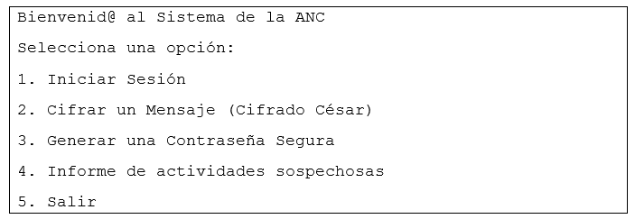
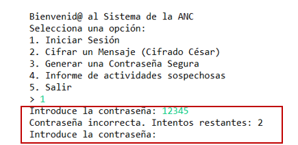

# Instrucciones

### RA3
La Agencia Nacional de Ciberseguridad se enfrenta a un aumento de ciberataques y necesita mejorar sus métodos de protección. 

Como parte del equipo de desarrollo, tu tarea es crear un sistema de seguridad para analizar los intentos de acceso y otros parámetros relacionados con la seguridad de los usuarios. El sistema permitirá a los agentes realizar diferentes operaciones como iniciar sesión, cifrar mensajes, generar contraseñas seguras y analizar patrones de intentos fallidos de acceso.

El programa debe mostrar un menú principal donde los agentes puedan seleccionar una opción. Este menú se mostrará indefinidamente hasta que se elija Salir:

### Si el agente pulsa la opción 1- Iniciar Sesión: (RA1+RA3)

Esta función permite realizar un inicio de sesión con una contraseña predefinida. (La contraseña es: D6a1M24, este valor debes guardarlo en una constante).

· Si el agente introduce la contraseña correcta, podrá acceder al sistema.

· Se permiten hasta tres intentos fallidos indicando cada vez los intentos que restan:

· Cuando los intentos se agoten:

